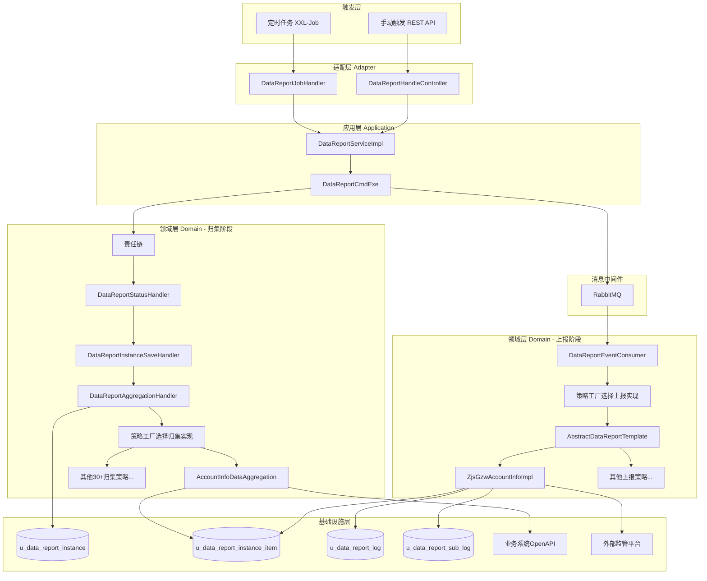
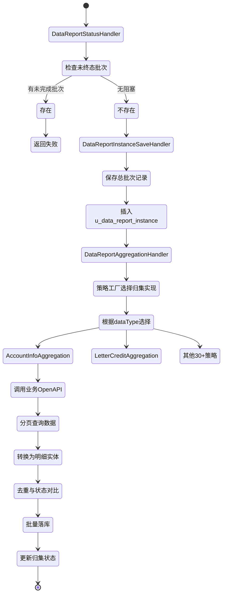
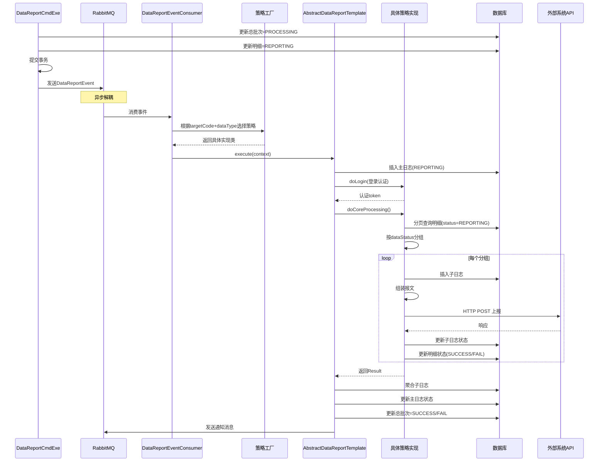

# 系统架构详解

## 整体架构图



---

## 核心流程详解

### 1. 归集阶段（同步执行）

#### 责任链执行顺序



#### 数据库操作细节

| 步骤 | 表 | 操作 | 字段 |
|------|-----|------|------|
| 状态校验 | `u_data_report_instance` | SELECT | WHERE processing_status IN (0,1,3) |
| 保存总批次 | `u_data_report_instance` | INSERT | batch_no, processing_status=0, collection_status=0 |
| 查询业务数据 | 外部OpenAPI | HTTP POST | http://cfs-account/open-api/account/bis/account-query |
| 落库明细 | `u_data_report_instance_item` | INSERT/UPDATE | batch_no, business_data(JSON), data_status, status=0 |
| 更新归集状态 | `u_data_report_instance` | UPDATE | collection_status=1 (成功) 或 2 (失败) |

---

### 2. 上报阶段（异步执行）

#### 消息驱动流程



---

## 策略注册与选择机制

### 策略注册（启动时）

```mermaid
graph LR
    A[Spring容器启动] --> B[扫描@DataAggregation]
    A --> C[扫描@DataReportService]
    
    B --> D[InitializingBean.afterPropertiesSet]
    C --> E[InitializingBean.afterPropertiesSet]
    
    D --> F[registry到DataReportHandlerContext]
    E --> F
    
    F --> G[Map: DataAggregation -> Class]
    F --> H[Map: TargetSystem+DataType -> Class]
```

### 策略选择（运行时）

**归集阶段**：
```java
// 1. 根据 dataType 查找
DataAggregationService bean = DataReportServiceFactory.getDataAggregationBean("account_info");

// 2. 从上下文Map中匹配
Map<DataAggregation, Class<? extends DataAggregationService>> map = 
    DataReportHandlerContext.getDataReportAggregationHandlerServiceMap();

// 3. 实例化并返回
return ApplicationContextUtils.getBean(matchedClass);
```

**上报阶段**：
```java
// 1. 根据 targetCode + dataType 查找
DataReportDomainService bean = 
    DataReportServiceFactory.getDomainBean("zjs_gzw", "account_info");

// 2. 从注册表匹配 @DataReportService(targetCode="zjs_gzw", reportType="account_info")
```

---

## 多租户与数据隔离

### 租户隔离机制

1. **实体层**：所有业务表继承 `TenantEntity`，自动包含 `tenant_id`
2. **插件层**：MyBatis-Plus 租户插件自动注入WHERE条件
3. **应用层**：从请求上下文获取租户ID，注入到所有查询

### 数据权限控制

- **组织维度**：明细表包含 `org_id`，按用户数据权限过滤
- **账号维度**：明细表包含 `account_number`，账户类数据按账号权限过滤
- **菜单维度**：通过 `menu_code` 关联权限配置

---

## 性能优化设计

### 1. 分页归集
- 配置化分页大小（默认500，可通过 `limitCount` 调整）
- 最大分页次数限制（500页），防止无限循环

### 2. 批量操作
- 明细批量保存：`batchSaveOrUpdate()`
- 状态批量更新：`batchUpdateStatus()`
- 子日志批量查询与聚合

### 3. 异步解耦
- 归集完成立即返回，上报异步执行
- 消息队列削峰，防止外部系统过载

### 4. 缓存策略
- 字典数据缓存（`DataReportDictCache`）
- 减少重复查询数据库

---

## 可扩展性设计

### 新增目标系统步骤

1. 创建认证策略：`XxxGzwLoginServiceImpl implements AuthHandlerService`
2. 创建上报基类：`AbstractXxxGzwServiceImpl extends AbstractDataReportTemplate`
3. 为每种数据类型创建具体实现并注解：
   ```java
   @DataReportService(targetCode = "xxx_gzw", reportType = "account_info")
   public class XxxGzwAccountInfoImpl extends AbstractXxxGzwServiceImpl
   ```
4. 配置表添加目标系统配置

### 新增数据类型步骤

1. 创建归集策略：
   ```java
   @DataAggregation(dataType = {"new_data_type"})
   public class NewDataAggregationImpl extends AbstractDataAggregationService
   ```
2. 为每个目标系统创建上报实现并注解
3. 配置OpenAPI路由枚举（如需内部调用）

---

## 监控与运维

### 日志埋点

- **归集日志**：`【数据上报】定时任务执行参数`, `归集数据异常`
- **上报日志**：`数据上报任务开始执行`, `数据上报任务执行完毕，耗时`
- **异常日志**：`数据上报任务执行异常`, `投递MQ失败`

### 关键指标

- 批次成功率：`SELECT COUNT(*) FROM u_data_report_instance WHERE processing_status=2`
- 明细上报成功率：`SELECT status, COUNT(*) FROM u_data_report_instance_item GROUP BY status`
- 平均归集耗时：通过日志分析
- 消息积压量：RabbitMQ控制台查看队列深度

### 故障排查

**问题1：返回400/500且msg为空**
- 检查是否有未终态批次阻塞
- 检查RabbitMQ连接是否正常
- 查看应用日志关键字

**问题2：归集数据为空**
- 检查 `conditionJson` 是否正确
- 验证业务OpenAPI是否可达（通过innerRestTemplate）
- 检查服务发现配置（Nacos）

**问题3：上报一直PROCESSING**
- 检查消费者是否正常工作
- 查看子日志表是否有失败记录
- 验证外部系统网络连通性

---

## 技术债务与改进方向

### 当前技术债

1. **错误处理不统一**：部分地方返回空msg，排查困难
2. **日志过于简单**：缺少traceId关联，分布式追踪困难
3. **测试覆盖不足**：核心链路缺少集成测试
4. **配置分散**：系统配置、接口配置、字段映射分散在多处

### 改进建议

1. **引入分布式追踪**：集成SkyWalking/Zipkin，traceId贯穿全链路
2. **完善异常体系**：定义业务异常码，统一错误返回格式
3. **补充测试**：责任链、策略选择、状态机流转的集成测试
4. **配置中心化**：归集与上报配置统一到Nacos，支持热更新
5. **监控告警**：接入Prometheus，关键指标超阈值告警

---

## 架构演进历史

### 初版设计（推测）
- 单体应用，if-else选择目标系统
- 同步归集与上报
- 无状态机，重复执行无防护

### 当前架构
- DDD分层 + 策略模式 + 模板方法
- 责任链前置校验 + 状态机防并发
- 异步消息解耦归集与上报

### 未来演进方向
- **CQRS**：归集写入与查询读取分离
- **事件溯源**：保留完整状态变更历史
- **Saga模式**：跨系统上报的分布式事务补偿
- **流式处理**：大批量数据用Stream处理，降低内存占用

