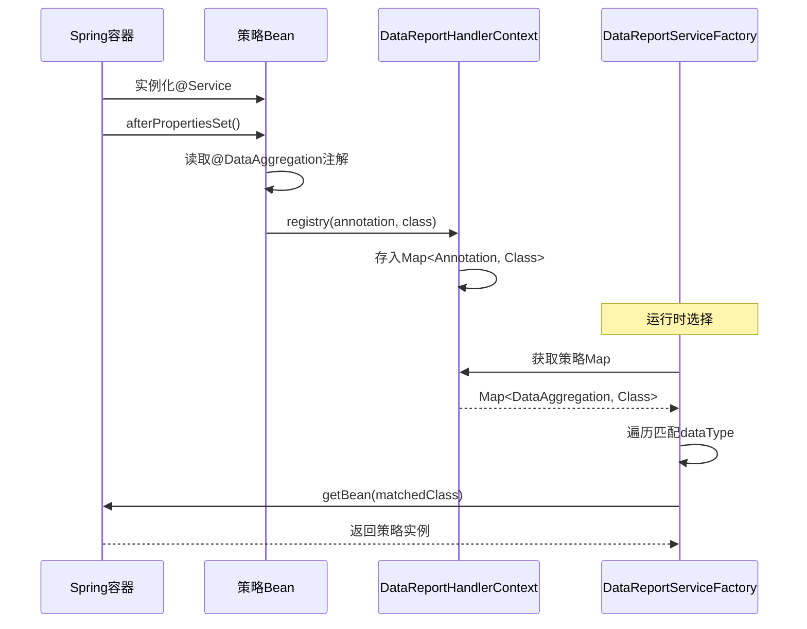
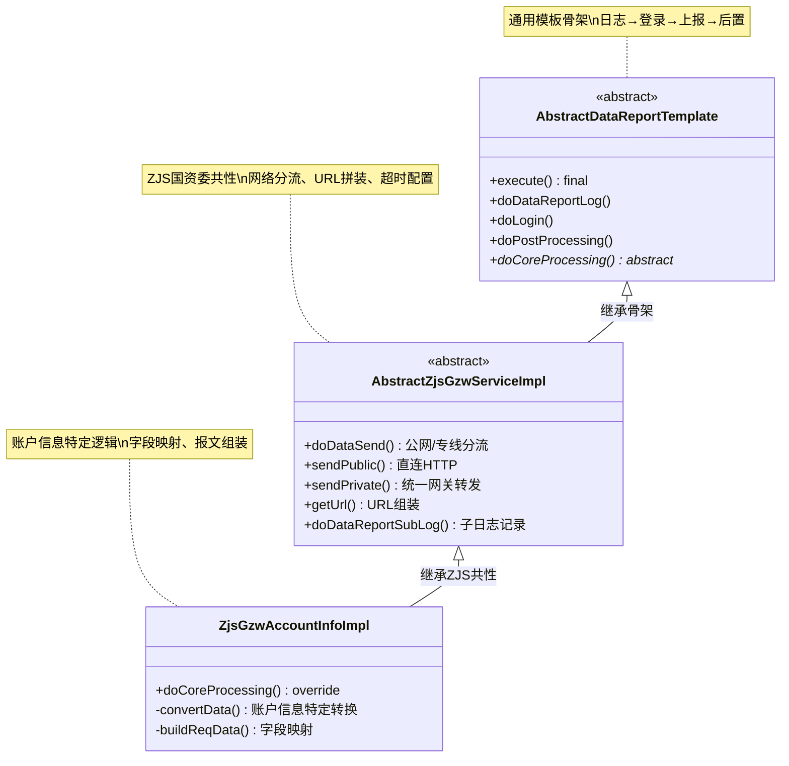
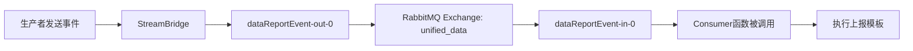

# 设计模式实战分析

## 1. 责任链模式（Chain of Responsibility）

### 场景

数据归集前需要经过多个校验与准备步骤，每个步骤独立且顺序固定。

### 实现代码映射

#### 抽象处理器

```java
// com.yocyl.dcp.ibf.domain.report.ability.chain.AbstraceDataReportCmdHandler
public abstract class AbstraceDataReportCmdHandler {
    protected AbstraceDataReportCmdHandler nextHandler;
    
    public void setNextHandler(AbstraceDataReportCmdHandler nextHandler) {
        this.nextHandler = nextHandler;
    }
    
    public abstract Result handle(DataReportCmd cmd);
}
```

#### 具体处理器示例

**处理器1：状态校验**
```java
// DataReportStatusHandler
public Result handle(DataReportCmd cmd) {
    // 查询是否存在未终态批次
    DataReportInstanceDTO dto = dataReportInstanceService.queryLastDataInstance(qry);
    if (Objects.nonNull(dto)) {
        return Result.fail("存在未处理的待上报数据");
    }
    // 传递给下一个处理器
    if(this.nextHandler != null){
        return nextHandler.handle(cmd);
    }
    return Result.success("");
}
```

**处理器2：保存总批次**
```java
// DataReportInstanceSaveHandler
public Result handle(DataReportCmd cmd) {
    DataReportInstance instance = new DataReportInstance();
    instance.setBatchNo(cmd.getBatchNo());
    instance.setProcessingStatus(WAITING);
    instance.setCollectionStatus(COLLECTING);
    
    boolean save = repository.save(instance);
    if (!save) {
        return Result.fail("保存数据上报实例失败");
    }
    
    if (this.nextHandler != null) {
        return nextHandler.handle(cmd);
    }
    return Result.data(cmd.getBatchNo());
}
```

**处理器3：执行归集**
```java
// DataReportAggregationHandler
public Result handle(DataReportCmd cmd) {
    DataAggregationCmd aggregationCmd = buildAggregationCmd(cmd);
    
    // 调用归集服务
    Result execute = dataAggregationDomainService.aggregation(aggregationCmd);
    
    // 更新归集状态
    execute = dataAggregationDomainService.updateCollectionStatus(aggregationCmd,
        Result.isSuccess(execute) ? COLLECTED : COLLECTION_FAIL);
    
    if (this.nextHandler != null) {
        return nextHandler.handle(cmd);
    }
    return execute;
}
```

#### 链路组装（Spring配置）

```java
// DataReportHandlerChainConfig
@Bean
public AbstraceDataReportCmdHandler dataReportHandlerChain(
        DataReportStatusHandler dataReportStatusHandler,
        DataReportAggregationHandler dataReportAggregationHandler,
        DataReportInstanceSaveHandler dataReportInstanceSaveHandler) {
    
    // 组装链路：状态校验 → 保存批次 → 归集
    dataReportStatusHandler.setNextHandler(dataReportInstanceSaveHandler);
    dataReportInstanceSaveHandler.setNextHandler(dataReportAggregationHandler);
    
    return dataReportStatusHandler; // 返回链头
}
```

### 优势分析

✅ **单一职责**：每个Handler只做一件事  
✅ **开闭原则**：新增校验步骤无需修改现有代码  
✅ **灵活顺序**：配置类中调整链路顺序  
✅ **短路机制**：任一步骤失败立即返回，不执行后续  

---

## 2. 策略模式（Strategy）

### 场景

系统需要支持多个目标系统（浙江国资委、泉州政务网等）和多种数据类型（账户、交易、合同等），每种组合的归集与上报逻辑不同。

### 实现代码映射

#### 策略接口

```java
// 归集策略接口
public interface DataAggregationService<RESPONSE> {
    Result aggregation(DataAggregationCmd cmd);
    List<RESPONSE> queryData(Page page, DataAggregationCmd cmd);
    String getBusinessId(RESPONSE data);
    void doPostProcessingChange(DataReportInstanceItem item, RESPONSE data);
}

// 上报策略接口
public interface DataReportDomainService {
    void execute(DataReportContext context);
}
```

#### 策略注解（声明式注册）

```java
// 归集策略注解
@Target(ElementType.TYPE)
@Retention(RetentionPolicy.RUNTIME)
public @interface DataAggregation {
    String[] dataType(); // 支持的数据类型
}

// 上报策略注解
@Target(ElementType.TYPE)
@Retention(RetentionPolicy.RUNTIME)
public @interface DataReportService {
    String targetCode();  // 目标系统编码
    String reportType();  // 数据类型
}
```

#### 具体策略实现

**归集策略示例**：
```java
@Service
@DataAggregation(dataType = {UnifiedDataReportConstant.ACCOUNT_INFO})
public class AccountInfoDataAggregationServiceImpl 
        extends AbstractDataAggregationService<BisAccountQueryResponse>
        implements InitializingBean {
    
    @Resource(name = "innerRestTemplate")
    private RestTemplate innerRestTemplate;
    
    @Override
    public List queryData(Page page, DataAggregationCmd cmd) {
        // 1. 解析查询条件
        BisAccountQueryRequest request = parse(cmd.getCondition());
        request.setTenantId(cmd.getTenantId());
        request.setPageNo((int) page.getCurrent());
        
        // 2. 调用内部OpenAPI
        ResponseEntity<BisResult<BisPage<BisAccountQueryResponse>>> response =
            innerRestTemplate.exchange(
                "http://cfs-account/open-api/account/bis/account-query",
                HttpMethod.POST, entity, typeReference);
        
        // 3. 返回数据列表
        return response.getData().getRecords();
    }
    
    @Override
    public String getBusinessId(BisAccountQueryResponse data) {
        return data.getUniqueId().toString();
    }
    
    @Override
    public void afterPropertiesSet() {
        // 自动注册到策略上下文
        super.registry(this.getClass().getAnnotationsByType(DataAggregation.class)[0], 
                       this.getClass());
    }
}
```

**上报策略示例**：
```java
@Service
@DataReportService(targetCode = "zjs_gzw", reportType = "account_info")
public class ZjsGzwAccountInfoDataReportDomainServiceImpl 
        extends AbstractZjsGzwServiceImpl 
        implements InitializingBean {
    
    @Override
    protected Result doCoreProcessing(DataReportContext ctx) {
        // 1. 查询待上报明细
        List<DataReportInstanceItem> items = repository.queryList(...);
        
        // 2. 按数据状态分组（新增/修改/删除）
        Map<Integer, List<DataReportInstanceItem>> dataMap = 
            items.stream().collect(groupingBy(DataReportInstanceItem::getDataStatus));
        
        // 3. 逐组处理
        dataMap.forEach((status, group) -> {
            DataReportReq req = this.convertData(group, ctx);
            DataReportSubLog subLog = super.doDataReportSubLog(ctx, req);
            Result<DataReportResp> resp = super.doDataSend(req, ctx);
            super.doDataReportSubLogUpdate(subLog, req.getItemIds());
        });
        
        return Result.success("完成");
    }
}
```

#### 策略工厂（运行时选择）

```java
public class DataReportServiceFactory {
    
    // 获取归集策略
    public static DataAggregationService getDataAggregationBean(String dataType) {
        Map<DataAggregation, Class<? extends DataAggregationService>> map = 
            DataReportHandlerContext.getDataReportAggregationHandlerServiceMap();
        
        for (Map.Entry<DataAggregation, Class<?>> entry : map.entrySet()) {
            String[] dataTypeKey = entry.getKey().dataType();
            if (Arrays.asList(dataTypeKey).contains(dataType)) {
                return ApplicationContextUtils.getBean(entry.getValue());
            }
        }
        return null;
    }
    
    // 获取上报策略
    public static DataReportDomainService getDomainBean(
            String targetSystemCode, String reportType) {
        // 类似逻辑，匹配 targetCode + reportType
        ...
    }
}
```

### 策略注册流程



### 优势分析

✅ **消除switch-case**：30+数据类型×8+目标系统 = 240+组合，无需硬编码  
✅ **运行时扩展**：新增策略只需添加类+注解，无需修改调用方  
✅ **Spring管理**：策略实例由容器管理，支持依赖注入  
✅ **类型安全**：编译期检查注解参数  

---

## 3. 模板方法模式（Template Method）

### 场景

所有目标系统的上报流程骨架一致：日志→登录→上报→后置处理，但每个系统的认证方式、报文格式、URL不同。

### 实现代码映射

#### 抽象模板类

```java
// AbstractDataReportTemplate
public abstract class AbstractDataReportTemplate implements DataReportDomainService {
    
    /**
     * 模板方法：固定流程骨架
     */
    @Override
    public final void execute(DataReportContext dataReportContext) {
        Result result = Result.success("");
        try {
            // 步骤1：记录主日志
            result = this.doDataReportLog(dataReportContext);
            
            // 步骤2：登录认证（可选）
            if (Result.isSuccess(result)) {
                result = this.doLogin(dataReportContext);
            }
            
            // 步骤3：核心上报（钩子方法，由子类实现）
            if (Result.isSuccess(result)) {
                result = this.doCoreProcessing(dataReportContext);
            }
            
        } catch (Exception e) {
            log.error("数据上报异常", e);
            result = Result.fail("数据上报处理异常");
        } finally {
            // 步骤4：后置处理（无论成功失败都执行）
            this.doPostProcessing(result, dataReportContext);
        }
    }
    
    /**
     * 钩子方法：由子类实现具体上报逻辑
     */
    protected abstract Result doCoreProcessing(DataReportContext dataReportContext);
    
    /**
     * 通用能力：记录主日志
     */
    private Result doDataReportLog(DataReportContext ctx) {
        DataReportLog log = new DataReportLog();
        log.setBatchNo(ctx.getBatchNo());
        log.setReportStatus(REPORTING);
        // ...
        return Result.success("");
    }
    
    /**
     * 通用能力：后置处理
     */
    protected void doPostProcessing(Result result, DataReportContext ctx) {
        // 1. 聚合子日志状态
        List<DataReportSubLog> subLogs = subLogRepository.listByLogId(logId);
        long failCount = subLogs.stream()
            .filter(s -> s.getReportStatus() == FAIL)
            .count();
        
        // 2. 更新主日志状态（全成功/全失败/部分成功）
        log.setReportStatus(
            failCount == 0 ? SUCCESS : 
            failCount == total ? FAIL : 
            PARTIAL_SUCCESS);
        
        // 3. 更新总批次状态
        instanceRepository.updateReportStatusByBatchNo(ctx.getBatchNo(),
            Result.isSuccess(result) ? SUCCESS : FAIL);
        
        // 4. 失败时更新明细状态
        if (!Result.isSuccess(result)) {
            itemRepository.batchUpdateReportingStatus(REPORT_FAIL);
        }
        
        // 5. 发送通知消息
        this.sendNotice(result, ctx);
    }
}
```

#### 具体子类实现

**中间层抽象（目标系统共性）**：
```java
// AbstractZjsGzwServiceImpl：封装浙江国资委共性
public abstract class AbstractZjsGzwServiceImpl extends AbstractDataReportTemplate {
    
    // 公网/专线分流
    public Result<DataReportResp> doDataSend(DataReportReq req, DataReportContext ctx) {
        if (ctx.getDataReportTargetSystemContext().getNetworkType() == PRIVATE) {
            return this.sendPrivate(req, ctx); // 通过统一网关转发
        }
        return this.sendPublic(req, ctx); // 直连公网
    }
    
    // 公网发送
    private Result<DataReportResp> sendPublic(DataReportReq req, DataReportContext ctx) {
        String url = this.getUrl(ctx);
        HttpHeaders headers = buildHeaders(ctx.getAuthResult());
        
        // 配置超时
        factory.setConnectTimeout(ctx.getInterfaceContext().getConnectionTimeout());
        factory.setReadTimeout(ctx.getInterfaceContext().getReadTimeout());
        
        RestTemplate restTemplate = new RestTemplate(factory);
        ResponseEntity<?> response = restTemplate.exchange(url, POST, entity, respClass);
        
        return response.is2xxSuccessful() ? 
            Result.data(response.getBody()) : 
            Result.fail(response);
    }
    
    // URL组装
    private String getUrl(DataReportContext ctx) {
        return ctx.getTargetSystemContext().getHttpRequestConfig().getUrl() +
               ctx.getInterfaceContext().getPath();
    }
}
```

**最终实现类（数据类型特定逻辑）**：
```java
@Service
@DataReportService(targetCode = "zjs_gzw", reportType = "account_info")
public class ZjsGzwAccountInfoDataReportDomainServiceImpl 
        extends AbstractZjsGzwServiceImpl {
    
    @Override
    protected Result doCoreProcessing(DataReportContext ctx) {
        // 1. 查询待上报明细
        List<DataReportInstanceItem> items = repository.queryList(
            buildQuery(ctx.getBatchNo(), REPORTING));
        
        // 2. 按数据状态分组
        Map<Integer, List<DataReportInstanceItem>> dataMap = 
            items.stream().collect(groupingBy(DataReportInstanceItem::getDataStatus));
        
        // 3. 逐组处理
        dataMap.forEach((status, group) -> {
            // 3.1 转换为目标系统报文格式
            DataReportReq req = this.convertData(group, ctx);
            
            // 3.2 记录子日志
            DataReportSubLog subLog = super.doDataReportSubLog(ctx, req);
            
            // 3.3 发送HTTP请求（调用父类方法）
            Result<DataReportResp> resp = super.doDataSend(req, ctx);
            
            // 3.4 根据响应更新子日志与明细状态
            if (Result.isSuccess(resp)) {
                ZjsGzwBaseReportResp body = (ZjsGzwBaseReportResp) resp.getData();
                subLog.setReportResult(toJson(body));
                subLog.setReportStatus(body.isSuccess() ? SUCCESS : FAIL);
            } else {
                subLog.setReportResult(resp.getMsg());
                subLog.setReportStatus(FAIL);
            }
            
            super.doDataReportSubLogUpdate(subLog, req.getItemIds());
        });
        
        return Result.success("完成");
    }
    
    // 数据转换逻辑（特定于账户信息）
    private DataReportReq convertData(List<DataReportInstanceItem> items, 
                                      DataReportContext ctx) {
        // 反序列化明细中的业务数据
        List<DataReportItem<AccountBisQueryResponse>> dataList = 
            DataReportInstanceItemFactory.toDataReportItemList(items, AccountBisQueryResponse.class);
        
        // 转换为浙江国资委账户信息报文格式
        List<ZjsGzwAccountInfoReportReq> reportReqs = dataList.stream()
            .map(item -> {
                ZjsGzwAccountInfoReportReq req = new ZjsGzwAccountInfoReportReq();
                req.setAccNo(item.getData().getAccountNumber());
                req.setAccBankName(item.getData().getBankLocation());
                req.setCorpCode(item.getData().getCreditCode());
                // ... 更多字段映射
                return req;
            })
            .collect(toList());
        
        // 包装为请求对象
        return DataReportReq.builder()
            .itemIds(items.stream().map(DataReportInstanceItem::getId).collect(toList()))
            .data(List.of(ZjsGzwBaseDataReportReq.builder()
                .reportType(ReportTypeEnum.ADD)
                .paramObj(reportReqs)
                .build()))
            .respClass(new ZjsGzwBaseReportResp())
            .build();
    }
}
```

### 三层继承的职责分离



### 优势分析

✅ **复用性**：浙江国资委的8个数据类型共享发送逻辑  
✅ **一致性**：所有上报都经过统一流程，状态流转一致  
✅ **易维护**：修改超时/URL/Header只需改抽象基类  
✅ **易测试**：每层可独立mock测试  

---

## 4. 工厂模式（Factory）+ 策略选择

### 策略上下文（注册表）

```java
public class DataReportHandlerContext {
    
    // 归集策略注册表
    private static final Map<DataAggregation, Class<? extends DataAggregationService>>
        DATA_REPORT_AGGREGATION_HANDLER_SERVICE_MAP = new ConcurrentHashMap<>();
    
    // 上报策略注册表
    private static final Map<DataReportService, Class<? extends DataReportDomainService>>
        DATA_REPORT_HANDLER_SERVICE_MAP = new ConcurrentHashMap<>();
    
    // 注册归集策略
    public static void registryDataAggregationServiceStrategy(
            DataAggregation annotation, 
            Class<? extends DataAggregationService> clazz) {
        DATA_REPORT_AGGREGATION_HANDLER_SERVICE_MAP.put(annotation, clazz);
    }
    
    // 注册上报策略
    public static void registryDataReportStrategy(
            DataReportService annotation, 
            Class<? extends DataReportDomainService> clazz) {
        DATA_REPORT_HANDLER_SERVICE_MAP.put(annotation, clazz);
    }
    
    // 获取注册表
    public static Map<DataAggregation, Class<? extends DataAggregationService>> 
        getDataReportAggregationHandlerServiceMap() {
        return DATA_REPORT_AGGREGATION_HANDLER_SERVICE_MAP;
    }
}
```

### 优势分析

✅ **零配置**：通过注解自动注册，无需XML/配置文件  
✅ **类型安全**：泛型保证策略接口一致性  
✅ **运行时灵活**：可动态加载新策略（如插件机制）  

---

## 5. 事件驱动架构（Event-Driven）

### 场景

归集与上报解耦，归集完成后异步触发上报，避免长时间阻塞。

### 实现代码映射

#### 事件定义

```java
@Data
public class DataReportEvent {
    private String tenantId;
    private String targetCode;
    private String dataType;
    private String batchNo;
    private String configJson;
    private Long userId;
    private String menuCode;
    private List<Long> itemIds;
}
```

#### 生产者

```java
@Component
public class DataReportEventProducerImpl implements DataReportEventProducer {
    
    private final StreamBridge streamBridge;
    
    @Override
    public boolean sendDataReportEvent(DataReportEvent event) {
        Message<DataReportEvent> message = MessageBuilder
            .withPayload(event)
            .setHeader(MessageConst.PROPERTY_TAGS, "data_report_event")
            .build();
        
        this.streamBridge.send("dataReportEvent-out-0", message);
        return true;
    }
}
```

#### 消费者（函数式编程模型）

```java
@Component
public class DataReportEventConsumerImpl {
    
    @Bean
    public Consumer<DataReportEvent> dataReportEvent() {
        return event -> {
            // 1. 构建上下文
            DataReportContext ctx = DataReportInstanceFactory.buildDataReportContext(
                event, systemConfig);
            
            // 2. 策略工厂选择实现
            DataReportDomainService domainService = 
                DataReportServiceFactory.getDomainBean(
                    ctx.getTargetCode(), ctx.getDataType());
            
            // 3. 执行模板方法
            domainService.execute(ctx);
        };
    }
}
```

#### 配置绑定

```yaml
spring:
  cloud:
    function:
      definition: dataReportEvent  # 声明函数bean
    stream:
      default-binder: rabbit
      bindings:
        dataReportEvent-out-0:
          destination: unified_data
          group: data_report_event
        dataReportEvent-in-0:
          destination: unified_data
          group: data_report_event
```

### 消息流转



### 优势分析

✅ **解耦**：归集完成立即返回，不等上报完成  
✅ **削峰**：大量触发时消息队列缓冲  
✅ **重试**：消费失败可重投（配置死信队列）  
✅ **扩展性**：上报消费者可独立扩容  

---

## 模式组合威力

### 多模式协作

```
触发 → 责任链(校验+归集) → 策略(选归集实现) 
     → 消息队列 
     → 策略(选上报实现) → 模板方法(固定流程) → 策略(目标系统差异)
```

### 扩展性示例

**新增一个目标系统（广东国资委）+ 账户信息数据类型**：

1. **创建认证策略**：
```java
@AuthTargetSystemType(targetSystem = "gds_gzw")
public class GdsGzwLoginServiceImpl implements AuthHandlerService {
    // 实现login()方法
}
```

2. **创建归集策略**（已有，账户归集通用）：
```java
// AccountInfoDataAggregationServiceImpl 已支持所有系统
```

3. **创建上报基类**：
```java
public abstract class AbstractGdsGzwServiceImpl extends AbstractDataReportTemplate {
    // 封装广东国资委的URL、Header、超时等共性
}
```

4. **创建具体上报实现**：
```java
@Service
@DataReportService(targetCode = "gds_gzw", reportType = "account_info")
public class GdsGzwAccountInfoImpl extends AbstractGdsGzwServiceImpl {
    @Override
    protected Result doCoreProcessing(DataReportContext ctx) {
        // 只需实现报文转换逻辑，其余都复用
    }
}
```

**无需修改**：
- 调度逻辑
- 责任链
- 工厂类
- 消息队列配置

---

## 设计权衡与思考

### 1. 为什么不用简单的if-else？

**如果用if-else**：
```java
// 反例：不可维护的代码
public void report(String targetCode, String dataType) {
    if ("zjs_gzw".equals(targetCode)) {
        if ("account_info".equals(dataType)) {
            // 浙江国资委账户逻辑
        } else if ("account_trans".equals(dataType)) {
            // 浙江国资委交易逻辑
        }
        // ... 30+ 个else if
    } else if ("qzs_zww".equals(targetCode)) {
        // 重复上面的30+个分支
    }
    // ... 8+ 个目标系统
}
// 结果：240+个分支，无法维护
```

**使用策略模式后**：
- 每个策略独立类，职责清晰
- 新增只需添加类+注解
- 编译期类型检查
- 可独立测试每个策略

### 2. 为什么异步？为什么不异步？

**异步的场景**（当前设计）：
- 归集可能耗时（大量数据分页查询）
- 上报可能耗时（外部系统响应慢）
- 需要削峰（定时任务集中触发）

**同步的场景**（责任链为何是同步）：
- 前置校验需要立即反馈（阻止并发）
- 归集数据需要落库后才能发事件（保证一致性）

### 3. 状态机为什么这么设计？

**为什么有两个状态字段**：
- `processing_status`：整体处理进度（等待→处理中→成功/失败）
- `collection_status`：归集子阶段（归集中→归集完成/失败）

**为什么FAIL也是非终态**：
- 失败需要人工介入/重试
- 新批次不应覆盖失败批次数据
- 需要明确"处理完成"才能进入终态

---

## 实际应用价值

### 业务价值

- **自动化**：减少人工上报错误与工作量
- **合规性**：满足政府监管要求，按时上报
- **可追溯**：完整日志记录，问题可回溯
- **多租户**：一套系统服务多个企业客户

### 技术价值

- **可扩展性**：新增目标系统/数据类型成本低
- **可维护性**：职责清晰，修改影响面小
- **可测试性**：每层可独立测试
- **高可用**：分布式锁+消息重试+状态机保证

---

## 学习收获

通过深入分析该系统，我学到了：

1. **企业级架构思维**：如何分层、如何抽象、如何扩展
2. **设计模式实战**：不是为了模式而模式，而是解决实际问题
3. **DDD实践**：领域层不依赖基础设施，通过接口隔离
4. **异步架构**：事件驱动的优势与代价
5. **状态机设计**：如何防并发、如何保证一致性

这些经验对我后续的系统设计能力提升很大。

